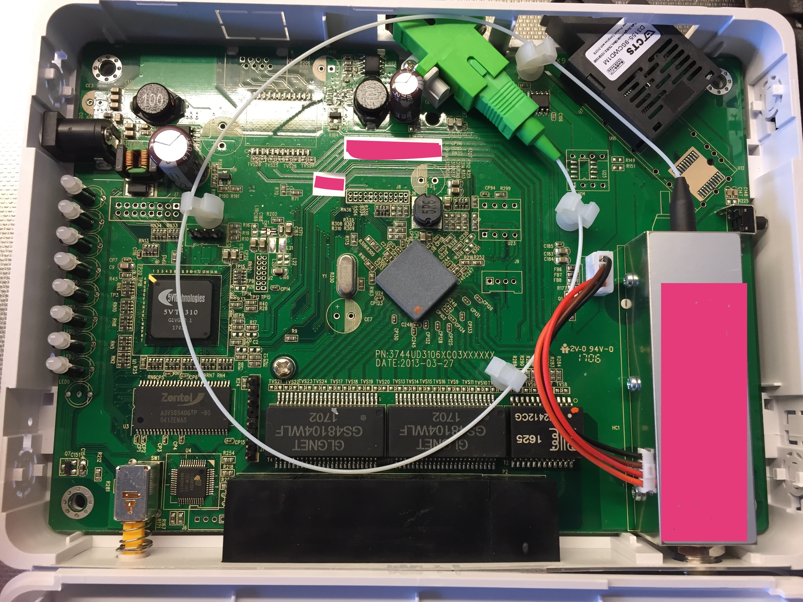

<!-- START doctoc generated TOC please keep comment here to allow auto update -->
<!-- DON'T EDIT THIS SECTION, INSTEAD RE-RUN doctoc TO UPDATE -->
**Table of Contents**  *generated with [DocToc](https://github.com/thlorenz/doctoc)*

- [Overview](#overview)
  - [HES-3106-RF board](#hes-3106-rf-board)
- [Configuration](#configuration)
  - [Auto-provisioning](#auto-provisioning)
  - [Obtaining a copy of the ISP's switch config](#obtaining-a-copy-of-the-isps-switch-config)
  - [Modifying the switch configuration](#modifying-the-switch-configuration)
  - [Emulating a DHCP request from the switch](#emulating-a-dhcp-request-from-the-switch)
- [Firmware hacking](#firmware-hacking)
  - [Firmware layout](#firmware-layout)
  - [Extracting and building firmware images](#extracting-and-building-firmware-images)
  - [Modifying the root file system](#modifying-the-root-file-system)
  - [Loading a new firmware](#loading-a-new-firmware)
  - [Toolchain for cross compiling](#toolchain-for-cross-compiling)
  - [Debugging hints](#debugging-hints)
- [Linux environment](#linux-environment)
  - [top](#top)
  - [cat /proc/cpuinfo](#cat-proccpuinfo)
  - [cat /proc/meminfo](#cat-procmeminfo)
  - [cat /proc/interrupts](#cat-procinterrupts)
  - [cat /proc/modules](#cat-procmodules)
  - [cat /proc/cmdline](#cat-proccmdline)
  - [cat /proc/mtd](#cat-procmtd)
  - [cat /proc/partitions](#cat-procpartitions)
  - [mount](#mount)
  - [df -h](#df--h)
  - [ps aux](#ps-aux)
  - [fw_printenv](#fw_printenv)
  - [dmesg](#dmesg)

<!-- END doctoc generated TOC please keep comment here to allow auto update -->

# Overview

The [CTS](https://www.ctsystem.com) HES-3106, HES-3109 and HES-3112 series are a line of managed fiber media converters/switches used in FTTX (fiber to the X) installations.  Out of the box they support QoS, 802.1q, 802.1ad (Q-in-Q), IGMP snooping and auto-provisioning (firmware and configuration) via DHCP.

The HES-3106 is built around a 5V Technologies [5VT1310](http://www.5vtechnologies.com/chipsets/5vt1310/) SoC with a 300MHz [ARM926EJS](https://www.arm.com/products/processors/classic/arm9/arm926.php) core, 32MB synchronous DRAM (Zentel A3V56S40GTP) and a [Lattice LC4032V-75TN Series CPLD](http://eu.mouser.com/Lattice/Semiconductors/Programmable-Logic-ICs/CPLD-Complex-Programmable-Logic-Devices/LC4032V-75TN-Series/_/N-3ohc6Z1ymc3vp?P=1yxnrpcZ1yam1q7Z1z0zl4q).  The switch is an [Atheros AR8327](https://wikidevi.com/files/Atheros/specsheets/AR8327_AR8327N.pdf) seven-port managed Layer 3 gigabit switch with hardware NAT.

It seems to run on a vendor-supplied Linux 2.6.17 (June, 2006) kernel.

Root access to the device can trivially be obtained locally via the DHCP auto-provisioning feature.

## HES-3106-RF board

# Configuration

## Auto-provisioning

In their DHCP requests, the devices include a  _Vendor Class Identifier_ (DHCP option 60) option containing their model name (e.g. `HES-3106-RF`).

A DHCP server may reply with a _Vendor-Specific Information_ (DHCP option 43) option that describes the location of the latest firmware and configuration file, and if the device should update itself immediately.

When the device receives a DHCP ACK with option 43 it will compare the MD5 hash of its current firmware and configuration to those mentioned in the offer.  If either do not match, the device will make up to three attempts of updating itself to the latest firmware and/or configuration before giving up.

Here's an example of the structure that can be sent in option 43, in ISC DHCP lingo:

    option space SWITCH;
    option SWITCH.protocol code 1 = unsigned integer 8;
    option SWITCH.server-ip code 2 = ip-address;
    option SWITCH.server-login-name code 3 = text;
    option SWITCH.server-login-password code 4 = text;
    option SWITCH.firmware-file-name 5 = text;
    option SWITCH.firmware-md5 code 6 = string;
    option SWITCH.configuration-file-name code 7 = text;
    option SWITCH.configuration-md5 code 8 = string;
    # 16 bit option (bit 0: Urgency; bit 1-15 reserved)
    option SWITCH.option code 9 = unsigned integer 16;
    
    option SWITCH.protocol = 0; // 0:TFTP, 1:FTP
    option SWITCH.server-ip = 1.2.3.4;
    option SWITCH.server-login-name = "";
    option SWITCH.server-login-password = "";
    
A more complete example in for dnsmasq.conf format:

    interface=eno1
    bind-interfaces
    dhcp-range=33.0.0.10,33.0.0.100,10m
    # Match DHCP option 60 vendor class identifier "HES-3106" and send
    # back the following structure in DHCP option 43:
    # option 1 (data) : 00 for TFTP, 01 for FTP
    # option 2 (IP)   : TFTP server IP
    # option 3 (text) : FTP username
    # option 4 (text) : FTP password
    # option 5 (text) : firmware filename
    # option 6 (data) : MD5 of firmware
    # option 7 (text) : config filename
    # option 8 (data) : MD5 of config (text plus zero padding up to 256KB)
    # option 9 (data) : 00:01 for urgency (immediate reboot), 00:00 otherwise
    # To obtain the MD5 hashes, try: openssl dgst -md5 -c < file.txt
    dhcp-option=vendor:HES-3106,1,00,2,33.0.0.1,5,"HES-3106_1.02.01_20130315-1749.bin",6,ea:96:82:a3:85:b3:57:d1:41:67:62:cb:d0:15:6f:a7,7,"HS_0600_file.conf",8,ea:56:fc:e4:d1:19:0f:bb:d3:6e:ea:4c:c1:1e:e8:d6,9,00:01
    log-dhcp
    enable-tftp
    tftp-secure
    tftp-root=/tftpboot

## Obtaining a copy of the ISP's switch config

Knowing this we can obtain a copy of the ISP's switch configuration with the following steps.

1. Disconnect the fiber from the top-right SC (Subscriber Connector) connector.
2. Reset the switch to factory defaults by putting a paper clip into the hole on the right side and press the reset button for 10-15 seconds
3. The switch will attempt to obtain an IP from a DHCP server on all ports so make sure it gets one (e.g. using dnsmasq)
4. Telnet to the switch's IP and login using user "admin" and just hit return when asked for a password
5. Use `enable` to enter privileged mode
6. Turn on port-mirroring using the `mirror` set of commands
7. Save the updated config using the `write` command
8. Start sniffing the traffic on the mirror destination port
9. Reboot the switch and watch it obtain a new configuration from the ISP's TFTP-server

Example session:

    $ telnet 33.0.0.10
    Trying 33.0.0.10...
    Connected to 33.0.0.10.
    Escape character is '^]'.

    Username: admin
    Password:
    HES-3106-RF> en
    Password:
    HES-3106-RF# configure
    HES-3106-RF(config)# mirror source 2,3,4,6
    HES-3106-RF(config)# mirror destination 5
    HES-3106-RF(config)# mirror mode by-port
    HES-3106-RF(config)# show mirror
    ===============================================================================
    Mirror Information :
    ===============================================================================
    Mirror Mode      : by-port
    Destination Port : port5

    Source Port:
    Port   State
    ----  -------
       1  disable
       2  enable
       3  enable
       4  enable
       5  disable
       6  enable

    HES-3106-RF(config)# exit
    HES-3106-RF# write
    Save Config Succeeded!
    HES-3106-RF#

On a related note, the device is claimed to support a final SNMP trap when power is cut to aid ISP customer service.  The firmware contains a `dyingGasp` executable with a corresponding kernel module. Example:

    $ qemu-arm -L $PWD  usr/sbin/dyingGasp
    error occur
    USAGE usr/sbin/dyingGasp:
    ex . usr/sbin/dyingGasp -en 1 -th 192.168.0.86 -tc public -oid 1.9304.100.2126.9 -if eth1 -ti 5
    -en : Enable(1) /Disable(0) dying Gasp
    -if : Specify output interface of network
    -ti : Prepare packet of trap of dying gasp according specified times (secs)
    -th : Snmp server ip
    -tc : Community
    -oid: Object id

## Modifying the switch configuration

Once you've obtained a copy of the "production" configuration, feel free to modify it to suit your needs.  For example, you might want to turn off a few SNMP traps and modify one or more access ports so they also accept tagged traffic for the management vlan.  Or adding more VLANs to trunk ports so you can investigate what else might be hiding in the network.

You can modify the "production" configuration offline and later restore it to the switch using a command similar to `copy-cfg from tftp 33.0.0.1 HS_0600_file.conf` (after repeating steps 1-5 in the previous section).

Assuming you're not using port-based VLAN mode, here's an example for howto make a port become a hybrid port which accepts untagged traffic for vlan 105 and tagged traffic for vlan 6.

    HES-3106-RF> en
    Password:
    HES-3106-RF# configure
    HES-3106-RF(config)# no snmp-server trap-type
    HES-3106-RF(config)# snmp-server trap-type auth-fail
    HES-3106-RF(config)# interface 5
    HES-3106-RF(config-if-5)# mode trunk native
    HES-3106-RF(config-if-5)# vlan dot1q-vlan access-vlan 105
    HES-3106-RF(config-if-5)# vlan dot1q-vlan trunk-vlan 6
    HES-3106-RF(config-if-5)# exit

To view the VLAN configuration, use `show vlan interface` and `show vlan dot1q-vlan`.  Example output:

    HES-3106-RF# show vlan interface
    ===============================================================================
    IEEE 802.1q Tag VLAN Interface :
    ===============================================================================
    Port  Port VLAN ID  Port User Priority  Port VLAN Mode
    ----  ------------  ------------------  --------------
       1           101                   0  trunk native
       2           102                   0  trunk native
       3           103                   0  trunk native
       4           104                   0  trunk native
       5           105                   0  trunk native
       6             1                   0  trunk

    HES-3106-RF# show vlan dot1q-vlan
    ===============================================================================
    IEEE 802.1q Tag VLAN :
    ===============================================================================
    VLAN Mode           : Tag VLAN
    CPU VLAN ID         : 6
    Management Priority : 3
    VLAN Name        VLAN  1    6 CPU
    ---------------  ----  ------ ---
    Default_VLAN        1  VVVVVV  -
    101               101  V----V  -
    102               102  VV----  -
    103               103  V-V---  -
    104               104  V--V--  -
    105               105  V---VV  -
    Management          6  VVVVVV  V

## Emulating a DHCP request from the switch

To emulate a HES-3106-RF switch's DHCP request on a computer connected to a trunk port, try:

    ip link add link eno1 name eno1.1 type vlan id 1
    ip link set dev eno1.1 up
    dhclient -V HES-3106-RF -H HES-3106-RF --request-options subnet-mask,broadcast-address,time-offset,routers,domain-search,domain-name,domain-name-servers,host-name,nis-domain,nis-servers,ntp-servers,interface-mtu,vendor-encapsulated-options eno1.1

# Firmware hacking

Some tools may be required for development and debugging.

    sudo dnf group install -y 'Development Tools'
    sudo dnf install -y zlib-devel xz-devel lzo-devel arm-none-eabi-gdb arm-none-eabi-gcc-cs gcc-arm-linux-gnu gcc-c++-arm-linux-gnu qemu-system-arm
    sudo dnf install -y ncurses-devel perl-Thread-Queue

## Firmware layout

The layout of firmware files are as follows, with little-endian integers.

    /**
     * 12 byte header:
     * - checksum (additive)
     * - size of install script payload
     * - size of firmware flasher payload
     */
    uint32_t fw_checksum;
    uint32_t fw_start_install_size;
    uint32_t fw_install_size;
    /**
     * Installation tools payload:
     * - start_install.sh frees up memory by killing most processes and takes
     *   care of updating the MTD (Flash) partitions using the fw_install tool.
     * - fw_install takes care of flashing the /dev/mtd/X (flash) partitions
     */
    uint8_t fw_start_install_data[fw_start_install_size];
    uint8_t fw_install_data[fw_install_size];

    /**
     * 12 byte header:
     * - size of kernel image
     * - size of rootfs image (SquashFS 2.1+LZMA little-endian)
     * - size of flash config image (JFFS2)
     */
    uint32_t kimage_size;
    uint32_t rimage_size;
    uint32_t cimage_size;
    /*
     * Flash partitions payload:
     * - u-boot legacy uImage for /dev/mtdblock/1
     * - root fs (SquashFS 2.1+LZMA, little-endian)) for /dev/mtdblock/2
     * - /flash config filesystem (JFFS2) for /dev/mtdblock/3
     */
    uint8_t kimage_data[kimage_size];
    uint8_t rimage_data[rimage_size];
    uint8_t cimage_data[cimage_size];

Some of the more recent (late 2015) firmwares also seem to embed a MD5 hash inside the `start_install.sh` script:

    # VERSION 5025 6000 10300 66079
    #!/bin/sh
    #kv26
    
    #BELOW CODE DONT CHANGE , MAKEFILE WILL CHANGE IT.
    CtSmD5FoR5Vt="c525cb54a583d3f85f60afa9ac351167"
    #res
    #res
    #res
    #res
    #res
    #res
    #res
    #res
    #res
    #res
    #res
    #res
    #res
    #res
    #res
    #res
    #ABOVE CODE DONT CHANGE , MAKEFILE WILL CHANGE IT.

## Extracting and building firmware images

This repo contains a small Python script to help with unpacking and packing firmware images.  However, it will not automatically update the MD5 hash in the `start_install.sh` script in newer firmware images.

Usage:

    $ ./cts-fw-tool.py 
    Usage: ./cts-fw-tool.py <command> <args>
      ./cts-fw-tool.py unpack <input.fw>
      ./cts-fw-tool.py pack <output.fw> <start_install.sh> <fw_install> <kernel.img> <rootfs.sfs>

Unpacking an image:

    $ ./cts-fw-tool.py unpack HPS-3106_FW_0.99.06_20170310.bin 
    [i] Unpacking HPS-3106_FW_0.99.06_20170310.bin
    [i] Reading 12 byte header...
    [+] Header checksum:                0x77c05580
    [+] Header start_install.sh size:   0x000031bb (12731)
    [+] Header fw_install size:         0x00001de4 (7652)
    [i] Computing firmware checksum...
    [+] Computed checksum:              0x77c05580
    [+] Saved   12731 bytes payload as: out_start_install.sh
    [+] Saved    7652 bytes payload as: out_fw_install
    [i] Reading 12 bytes header...
    [+] Header kernel.img size:         0x000b5ada (744154)
    [+] Header rootfs.sfs size:         0x0025474a (2443082)
    [+] Header cimage size:             0x00000000 (0)
    [+] Saved  744154 bytes payload as: out_kernel.img
    [+] Saved 2443082 bytes payload as: out_rootfs.sfs

    $ ls -l out_*
    -rw-------. 1 nobody nogroup    7652 Jan  1 03:34 out_fw_install
    -rw-------. 1 nobody nogroup  744154 Jan  1 03:34 out_kernel.img
    -rw-------. 1 nobody nogroup 2443082 Jan  1 03:34 out_rootfs.sfs
    -rw-------. 1 nobody nogroup   12731 Jan  1 03:34 out_start_install.sh
    $ file out_*
    out_fw_install:       ELF 32-bit LSB executable, ARM, version 1 (ARM), dynamically linked, interpreter /lib/ld-uClibc.so.0, stripped
    out_kernel.img:       u-boot legacy uImage, Linux-2.6.17, Linux/ARM, OS Kernel Image (lzma), 744090 bytes, Fri Nov  4 08:57:35 2016, Load Address: 0x40008000, Entry Point: 0x40008000, Header CRC: 0x830841A4, Data CRC: 0x7DFB5109
    out_rootfs.sfs:       Squashfs filesystem, little endian, version 2.1, 2443082 bytes, 878 inodes, blocksize: 65536 bytes, created: Fri Mar 10 06:51:53 2017
    out_start_install.sh: ASCII text
    
Packing a new firmware image:

    $ ./cts-fw-tool.py pack repackaged-firmware.bin out_start_install.sh out_fw_install out_kernel.img out_rootfs.sfs
    [i] Writing 12 byte header...
    [+] Header checksum:                0x00000000
    [+] Header start_install.sh size:   0x000031bb (12731)
    [+] Header fw_install size:         0x00001de4 (7652)
    [i] Writing install payloads...
    [+] Wrote   12731 bytes payload from file: out_start_install.sh
    [+] Wrote    7652 bytes payload from file: out_fw_install
    [i] Writing 12 byte header...
    [+] Header kernel.img size:         0x000b5ada (744154)
    [+] Header rootfs.sfs size:         0x0025474a (2443082)
    [+] Header cimage size:             0x00000000 (0)
    [i] Writing image payloads...
    [+] Wrote  744154 bytes payload from file: out_kernel.img
    [+] Wrote 2443082 bytes payload from file: out_rootfs.sfs
    [i] Computing firmware checksum...
    [+] Updating checksum in header:    0x77c05580

    $ md5sum HPS-3106_FW_0.99.06_20170310.bin repackaged-firmware.bin 
    cfeafca340cd21fe1d05271027ce1e1e  HPS-3106_FW_0.99.06_20170310.bin
    cfeafca340cd21fe1d05271027ce1e1e  repackaged-firmware.bin

## Modifying the root file system

The root filesystem is a SquashFS 2.1 image with non-standard LZMA compression.  While [modern versions](http://www.squashfs-lzma.org) of SquashFS supports LZMA, it wasn't until Linux 2.6.38 (March, 2011) full support went into mainline.  A popular source for the older SquashFS 2.x tools with LZMA support patched in is the [Firmware Mod Kit](https://github.com/mirror/firmware-mod-kit).

    $ git clone https://github.com/mirror/firmware-mod-kit
    $ cd firmware-mod-kit/src/squashfs-2.1-r2
    $ make   # build mksquashfs-lzma and unsquashfs-lzma

Extracting, modifying and rebuilding a firmware image:

    $ ./cts-fw-tool.py unpack HES-3106_1.02.01_20130315-1749.bin
    [i] Unpacking HES-3106_1.02.01_20130315-1749.bin
    [i] Reading 12 byte header...
    [+] Header checksum:                0xafae97a2
    [+] Header start_install.sh size:   0x00000ba9 (2985)
    [+] Header fw_install size:         0x00001de4 (7652)
    [i] Computing firmware checksum...
    [+] Computed checksum:              0xafae97a2
    [+] Saved    2985 bytes payload as: out_start_install.sh
    [+] Saved    7652 bytes payload as: out_fw_install
    [i] Reading 12 bytes header...
    [+] Header kernel.img size:         0x000b47b9 (739257)
    [+] Header rootfs.sfs size:         0x00213ef9 (2178809)
    [+] Header cimage size:             0x00000000 (0)
    [+] Saved  739257 bytes payload as: out_kernel.img
    [+] Saved 2178809 bytes payload as: out_rootfs.sfs

    $ sudo ~/src/firmware-mod-kit/src/squashfs-2.1-r2/unsquashfs-lzma -dest /tmp/r out_rootfs.sfs 

    created 515 files
    created 49 directories
    created 243 symlinks
    created 0 devices
    created 0 fifos

Let's add another root account named `toor` and start the telnetd service on port 24 in `/etc/init.d/rc`.

    $ echo toor:$(openssl passwd -1 -salt '' -stdin <<< s3cr3t):0:0::/:/bin/ash | sudo tee -a /tmp/r/etc/passwd
    toor:$1$$8wfgbw8tWcF1NeJjBFZit1:0:0::/:/bin/ash
    $ sudo sed -i '/hostname localhost/a telnetd -p 24' /tmp/r/etc/init.d/rc

Build the new root filesystem and firmware.

    $ sudo ~/src/firmware-mod-kit/src/squashfs-2.1-r2/mksquashfs-lzma /tmp/r new_rootfs.sfs -le
    Creating little endian 2.1 filesystem on new_rootfs.sfs, block size 65536.
    
    Little endian filesystem, data block size 65536, compressed data, compressed metadata, compressed fragments
    Filesystem size 2123.19 Kbytes (2.07 Mbytes)
    	27.39% of uncompressed filesystem size (7750.72 Kbytes)
    Inode table size 4508 bytes (4.40 Kbytes)
    	25.23% of uncompressed inode table size (17868 bytes)
    Directory table size 5747 bytes (5.61 Kbytes)
    	55.33% of uncompressed directory table size (10387 bytes)
    Number of duplicate files found 25
    Number of inodes 807
    Number of files 515
    Number of fragments 45
    Number of symbolic links  243
    Number of device nodes 0
    Number of fifo nodes 0
    Number of socket nodes 0
    Number of directories 49
    Number of uids 1
    	root (0)
    Number of gids 0

    $ sudo chmod +r new_rootfs.sfs
    $ ./cts-fw-tool.py pack repackaged-firmware.bin out_start_install.sh out_fw_install out_kernel.img new_rootfs.sfs 
    [i] Packing repackaged-firmware.bin
    [i] Writing 12 byte header...
    [+] Header checksum:                0x00000000
    [+] Header start_install.sh size:   0x00000ba9 (2985)
    [+] Header fw_install size:         0x00001de4 (7652)
    [i] Writing install payloads...
    [+] Wrote    2985 bytes payload from file: out_start_install.sh
    [+] Wrote    7652 bytes payload from file: out_fw_install
    [i] Writing 12 byte header...
    [+] Header kernel.img size:         0x000b47b9 (739257)
    [+] Header rootfs.sfs size:         0x00213000 (2174976)
    [+] Header cimage size:             0x00000000 (0)
    [i] Writing image payloads...
    [+] Wrote  739257 bytes payload from file: out_kernel.img
    [+] Wrote 2174976 bytes payload from file: new_rootfs.sfs
    [i] Computing firmware checksum...
    [+] Updating checksum in header:    0xfe724bc0

    $ ls -l HES-3106_1.02.01_20130315-1749.bin repackaged-firmware.bin
    -rw-------. 1 nobody nogroup 2928727 Mar 10 14:52 HES-3106_1.02.01_20130315-1749.bin
    -rw-------. 1 nobody nogroup 2924894 Jan  1 04:27 repackaged-firmware.bin

## Loading a new firmware

    $ telnet 33.0.0.10
    Trying 33.0.0.10...
    Connected to 33.0.0.10.
    Escape character is '^]'.

    Username: admin
    Password: 
    HES-3106-RF> en
    Password: 
    HES-3106-RF# firmware upgrade tftp 33.0.0.1 repackaged-firmware.bin
    ...............................................................................
    ................................................................................
    ................................................................................
    ................................................................

    Updating Firmware...Please do NOT turn off the power. 
    System will auto-reboot after finishing(about 4 Min.)....

## Toolchain for cross compiling

Download and extract [Buildroot](https://buildroot.org/).

    curl -s https://buildroot.org/downloads/buildroot-2015.08.1.tar.bz2 | tar jxvf -
    cd buildroot-2015.08.1
    make menuconfig
    # Select target architecture: ARM (little endian)
    # Select target architecture variant: arm926t
    make -j 4

Test the compiler.

    export PATH=$PATH:$PWD/output/host/usr/bin
    echo 'int main() { return 0; }' > test.c
    arm-buildroot-linux-uclibcgnueabi-gcc test.c
    file a.out

> a.out: ELF 32-bit LSB executable, ARM, EABI5 version 1 (SYSV), dynamically linked, interpreter /lib/ld-uClibc.so.0, not stripped

## Debugging hints

To run executables from the SquashFS filesystem, try the following from the SquashFS root directory.

    $ qemu-arm -L $PWD bin/ls

For remote debugging with gdb:

    [terminal-1]$ qemu-arm -g 1234 -L $PWD bin/ls
    [terminal-2]$ gdb bin/ls
    (gdb) set architecture arm
    (gdb) target remote localhost:1234
    0xf67f2f60 in _start ()
       from /tmp/a/lib/ld-uClibc-0.9.28.so

A nice online ARM decompiler with disassembly and Hex-Rays style out is provided on the [Retargetable Compiler](https://retdec.com/decompilation/) page.

# Linux environment

Examples from a HES-3106-RF device.

## top

    Mem: 12236K used, 18044K free, 0K shrd, 1280K buff, 4440K cached
    user 4.8% nice 0.0% sys 7.3% idle 87.9% io 0.0% irq 0.0% softirq 0.0%
    Load average: 1.60, 0.87, 0.35  (S=sleeping R=running, W=waiting, HZ=100)

## cat /proc/cpuinfo

    Processor   : ARM926EJ-Sid(wb) rev 5 (v5l)
    BogoMIPS    : 259.68
    Features    : swp half fastmult edsp java 
    CPU implementer     : 0x41
    CPU architecture: 5TEJ
    CPU variant : 0x0
    CPU part    : 0x926
    CPU revision        : 5
    Cache type  : write-back
    Cache clean : cp15 c7 ops
    Cache lockdown      : format C
    Cache format        : Harvard
    I size              : 16384
    I assoc             : 4
    I line length       : 32
    I sets              : 128
    D size              : 16384
    D assoc             : 4
    D line length       : 32
    D sets              : 128
    
    Hardware    : 5VT13XX
    Revision    : 0000
    Serial              : 0000000000000000

## cat /proc/meminfo

    MemTotal:        30280 kB
    MemFree:         18044 kB
    Buffers:          1280 kB
    Cached:           4448 kB
    SwapCached:          0 kB
    Active:           4956 kB
    Inactive:         3788 kB
    HighTotal:           0 kB
    HighFree:            0 kB
    LowTotal:        30280 kB
    LowFree:         18044 kB
    SwapTotal:           0 kB
    SwapFree:            0 kB
    Dirty:               0 kB
    Writeback:           0 kB
    Mapped:           5380 kB
    Slab:             2008 kB
    CommitLimit:     15140 kB
    Committed_AS:     6756 kB
    PageTables:        244 kB
    VmallocTotal:   286720 kB
    VmallocUsed:      8624 kB
    VmallocChunk:   278012 kB
    
## cat /proc/interrupts

               CPU0
      1:      11072   serial
      4:      51378   5VT Timer1 Tick
      7:        701   eth0
    Err:          0

## cat /proc/modules

    drv_dhcpvid 15904 0 - Live 0xbf024000
    wdog 3612 0 - Live 0xbf022000
    fvmem 5336 0 - Live 0xbf01f000
    fvmac_sb 63644 1 drv_dhcpvid, Live 0xbf00e000
    ar8327 5832 1 fvmac_sb, Live 0xbf00b000
    fvmac 25484 2 fvmac_sb, Live 0xbf003000
    fvgpio 4456 0 - Live 0xbf000000

## cat /proc/cmdline

    root=/dev/mtdblock2 ro cpufreq=270MHZ rootfstype=squashfs mem=32M console=ttyS0,38400 mtdparts=5VT13XX_mapped_flash:0x00400000@0x0(U-Boot),0xC0000@0x20000(Kimage),0x270000@0xE0000(Rimage),0x80000@0x370000(Cimage),0x10000@0x3F0000(u-boot-env),0x10000@0x350000(reserved),0x10000@0x360000(mfg_cfg) nopci

## cat /proc/mtd

    dev:    size   erasesize  name
    mtd0: 00400000 00010000 "U-Boot"
    mtd1: 000c0000 00010000 "Kimage"
    mtd2: 00270000 00010000 "Rimage"
    mtd3: 00080000 00010000 "Cimage"
    mtd4: 00010000 00010000 "u-boot-env"
    mtd5: 00010000 00010000 "reserved"
    mtd6: 00010000 00010000 "mfg_cfg"
    
## cat /proc/partitions

    major minor  #blocks  name
    
      31     0       4096 mtdblock0
      31     1        768 mtdblock1
      31     2       2496 mtdblock2
      31     3        512 mtdblock3
      31     4         64 mtdblock4
      31     5         64 mtdblock5
      31     6         64 mtdblock6

## mount

    /dev/root on / type squashfs (ro)
    /proc on /proc type proc (rw)
    /dev/mtdblock/3 on /flash type jffs2 (rw)
    /dev/rd0 on /var type ramfs (rw)
    none on /dev/pts type devpts (rw)

## df -h

    Filesystem                Size      Used Available Use% Mounted on
    /dev/root                 1.9M      1.9M         0 100% /
    /dev/mtdblock/3         512.0k    244.0k    268.0k  48% /flash

## ps aux

      PID  Uid     VmSize Stat Command
        1 root        316 S   init             
        2 root            SWN [ksoftirqd/0]
        3 root            SW< [events/0]
        4 root            SW< [khelper]
        5 root            SW< [kthread]
        7 root            SW< [kblockd/0]
       28 root            SW  [pdflush]
       29 root            SW  [pdflush]
       30 root            SW  [kswapd0]
       31 root            SW< [aio/0]
       65 root            SW  [mtdblockd]
       95 root            SWN [jffs2_gcd_mtd3]
      180 root        536 S   /bin/sw_proc proc 
      184 root        756 S   /tmp/igmp_proc 
      206 root        204 S   /tmp/igmp_proc 
      207 root        496 S   /tmp/igmp_proc 
      212 root            DW< [dhcpvid_recv]
      227 root        320 S   /bin/sh /etc/init.d/runtask.sh boot 
      234 root       2376 S   /bin/util 
      260 root        204 S   /bin/runloop 10 /bin/util 
      317 root       2376 S   /bin/util 
      319 root       2376 S   /bin/util 
      320 root       2376 S   /bin/util 
      321 root       2376 S   /bin/util 
      322 root       2376 S   /bin/util 
      323 root       2376 S   /bin/util 
      324 root       2376 S   /bin/util 
      378 root        536 S   /bin/sw_proc proc 
      379 root        536 S   /bin/sw_proc proc 
      380 root        536 S   /bin/sw_proc proc 
      410 root        172 S   /opt/httpd/sbin/looprun 1 /opt/httpd/sbin/boa.arm -d -c /opt/httpd -f /var/run/boa.conf 
      412 root        340 S   /opt/httpd/sbin/boa.arm -d -c /opt/httpd -f /var/run/boa.conf 
      619 root        224 S   udhcpc -s /etc/udhcpc.script -h HES-3106-RF -V HES-3106-RF -i eth0 
      633 root       1180 S   /usr/sbin/snmpd 
      634 root        356 S   /usr/sbin/snmptrap 
      698 root        232 S   /sbin/agetty -L /dev/tts/0 

## fw_printenv

    bootcmd=run romboot
    bootcmd_d=run romboot_d
    baudrate=38400
    ipaddr=192.168.0.42
    serverip=192.168.0.100
    gatewayip=192.168.0.254
    netmask=255.255.255.0
    uboot_addr=1F000000
    uboot_size=0x20000
    uboot_addr_end=1F01FFFF
    uboot_env_size=0x10000
    uboot_env_offset=0x3F0000
    kernel_addr=1F020000
    kernel_size=0xC0000
    kernel_offset=0x20000
    kernel_addr_end=1F0DFFFF
    rootfs_addr=1F0E0000
    rootfs_offset=0xE0000
    config_addr=1F370000
    config_size=0x80000
    config_offset=0x370000
    config_addr_end=1F3EFFFF
    firmware_addr=0x1F020000
    firmware_addr_end=0x1F3EFFFF
    mtd_id=5VT13XX_mapped_flash
    USER=.trunk
    tty=ttyS0
    rootfs=squashfs
    rootdev=/dev/mtdblock2 ro
    zip_format=lzma
    memtmp_addr=800000
    mem_size=32M
    rootpath=/opt/montavista/pro/devkit/arm/v4t_le/target/
    upsuccess=setenv upfail 0;saveenv
    nfsargs=setenv bootargs nfsroot=$(serverip):$(rootpath)
    addip=setenv bootargs $(bootargs) ip=$(ipaddr):$(serverip):$(gatewayip):$(netmask):$(hostname):$(netdev):off
    misca=setenv bootargs $(bootargs) root=$(rootdev)
    miscb=setenv bootargs $(bootargs) cpufreq=$(inputfreq)
    miscc=setenv bootargs $(bootargs) rootfstype=$(rootfs)
    miscd=setenv bootargs $(bootargs) mem=$(mem_size)
    misce=setenv bootargs $(bootargs) console=$(tty),$(baudrate)
    miscf=setenv bootargs $(bootargs) mtdparts=$(mtd_parts)
    miscg=setenv bootargs $(bootargs) $(pci_on)
    miscz=echo \\c
    miscz_d=echo \\c
    misc=run misca miscb miscc miscd misce miscf miscg miscz
    nfsboot=run nfsargs addip misc;bootm $(kernel_addr)
    ramboot=run partition misc;bootm $(kernel_addr) $(rootfs_addr)
    romboot=run partition misc;bootm $(kernel_addr)
    romboot_d=run partition_d misc mlb mtrcd;bootm $(kernel_addr_d)
    download=tftpboot
    uimagename=u-boot.bin
    erase_uimage=erase $(uboot_addr) $(uboot_addr_end)
    uimage=$(download) $(memtmp_addr) $(uimagename);run erase_uimage;cp.b $(memtmp_addr) $(uboot_addr) $(filesize)
    erase_kimage=erase $(kernel_addr) $(kernel_addr_end)
    erase_rimage=erase $(rootfs_addr) $(rootfs_addr_end)
    erase_cimage=erase $(config_addr) $(config_addr_end)
    kimage=$(download) $(memtmp_addr) Kimage$(USER).$(zip_format);run erase_kimage;cp.b $(memtmp_addr) $(kernel_addr) $(filesize)
    rimage=$(download) $(memtmp_addr) Rimage$(USER).$(rootfs);run erase_rimage;cp.b $(memtmp_addr) $(rootfs_addr) $(filesize)
    cimage=$(download) $(memtmp_addr) Cimage$(USER).jffs2;run erase_cimage;cp.b $(memtmp_addr) $(config_addr) $(filesize)
    erase_fimage=erase $(firmware_addr) $(firmware_addr_end)
    fimage=$(download) $(memtmp_addr) BASS_ONE$(USER);run erase_fimage;cp.b $(memtmp_addr) $(firmware_addr) $(filesize); run upsuccess
    TRCD=5
    LB=33
    mlb=mw.l 19c04000 $(LB)
    mtrcd=mw.l 19c04024 $(TRCD)
    pci_on=nopci
    auto_upgrade=0
    bootdelay=1
    eth1addr=00:06:19:00:00:01
    eth2addr=00:06:19:00:00:02
    sPad1=1081410094
    sPad2=1081410122
    sPad3=1081410162
    inputfreq=270MHZ
    rootfs_size=0x270000
    rootfs_addr_end=0x1F34FFFF
    reserved_addr=0x1F350000
    reserved_size=0x10000
    reserved_offset=0x350000
    reserved_addr_end=0x1F35FFFF
    mfg_cfg_addr=0x1F360000
    mfg_cfg_size=0x10000
    mfg_cfg_offset=0x360000
    mfg_cfg_addr_end=0x1F36FFFF
    partition=setenv mtd_parts $(mtd_id):$(flashsize)@0x0(U-Boot),$(kernel_size)@$(kernel_offset)(Kimage),$(rootfs_size)@$(rootfs_offset)(Rimage),$(config_size)@$(config_offset)(Cimage),$(uboot_env_size)@$(uboot_env_offset)(u-boot-env),$(reserved_size)@$(reserved_offset)(reserved),$(mfg_cfg_size)@$(mfg_cfg_offset)(mfg_cfg)
    flashsize=0x00400000
    stdin=serial
    stdout=serial
    stderr=serial
    company=Connection Technology Systems   
    product=HES-3106-RF             
    hw_ver=C03 
    sdate=20150511
    SN=3900000H1000000 
    ethaddr=00:06:19:00:00:42
    company_id=1561
    product_id=43
    version=1
    cvid=0
    fb_type=WDM   
    fb_cfg=4
    fb_tx=1310
    fb_rx=1550
    fb_dist=10000
    fb_speed=1000
    fb_type2=N/A   
    fb_cfg2=0
    fb_tx2=0
    fb_rx2=0
    fb_dist2=0
    fb_speed2=0
    fb_type3=N/A   
    fb_cfg3=0
    fb_tx3=0
    fb_rx3=0
    fb_dist3=0
    fb_speed3=0
    lType=3
    sw_ver=0

## dmesg

    Linux version 2.6.17 (root@debian) (gcc version 4.1.1) #226 Wed Feb 11 18:31:17 CST 2015
    CPU: ARM926EJ-Sid(wb) [41069265] revision 5 (ARMv5TEJ)
    Machine: 5VT13XX
    Ignoring unrecognised tag 0x00000000
    Memory policy: ECC disabled, Data cache writealloc
    On node 0 totalpages: 8192
      DMA zone: 8192 pages, LIFO batch:1
    CPU0: D VIVT write-back cache
    CPU0: I cache: 16384 bytes, associativity 4, 32 byte lines, 128 sets
    CPU0: D cache: 16384 bytes, associativity 4, 32 byte lines, 128 sets
    Built 1 zonelists
    Kernel command line: root=/dev/mtdblock2 ro cpufreq=270MHZ rootfstype=squashfs mem=32M console=ttyS0,38400 mtdparts=5VT13XX_mapped_flash:0x00400000@0x0(U-Boot),0xC0000@0x20000(Kimage),0x270000@0xE0000(Rimage),0x80000@0x370000(Cimage),0x10000@0x3F0000(u-boot-env),0x10000@0x350000(reserved),0x10000@0x360000(mfg_cfg) nopci
    PID hash table entries: 256 (order: 8, 1024 bytes)
    Timer1 load register: 675839(0x000A4FFF)
    Dentry cache hash table entries: 4096 (order: 2, 16384 bytes)
    Inode-cache hash table entries: 2048 (order: 1, 8192 bytes)
    Memory: 32MB = 32MB total
    Memory: 30180KB available (1684K code, 329K data, 80K init)
    Calibrating delay loop... 259.68 BogoMIPS (lpj=1298432)
    Mount-cache hash table entries: 512
    CPU: Testing write buffer coherency: ok
    NET: Registered protocol family 16
    NET: Registered protocol family 2
    IP route cache hash table entries: 256 (order: -2, 1024 bytes)
    TCP established hash table entries: 1024 (order: 0, 4096 bytes)
    TCP bind hash table entries: 512 (order: -1, 2048 bytes)
    TCP: Hash tables configured (established 1024 bind 512)
    TCP reno registered
    NetWinder Floating Point Emulator V0.97 (double precision)
    squashfs: version 3.1 includes LZMA decompression support (2006/08/29) Phillip Lougher
    JFFS2 version 2.2. (NAND) (C) 2001-2003 Red Hat, Inc.
    Initializing Cryptographic API
    io scheduler noop registered
    io scheduler deadline registered (default)
    
    CPLD REGISTER0 =01
    CPLD REGISTER1 =01
    CPLD REGISTER2 =12
    Inserting CPLD module
    Inserting SMI module
    WDT: Module loaded.
     Init cts i2c 
     Init cts i2c 2 
    Serial: 8250/16550 driver $Revision: 1.90 $ 2 ports, IRQ sharing disabled
    serial8250: ttyS0 at MMIO 0x1e840000 (irq = 1) is a 16550A
    serial8250: ttyS1 at MMIO 0x1e860000 (irq = 2) is a 16550A
    RAMDISK driver initialized: 16 RAM disks of 4096K size 1024 blocksize
    loop: loaded (max 8 devices)
    PPP generic driver version 2.4.2
    PPP Deflate Compression module registered
    NET: Registered protocol family 24
    physmap flash device: 800000 at 1f000000
    Number of erase regions: 2
    Primary Vendor Command Set: 0002 (AMD/Fujitsu Standard)
    Primary Algorithm Table at 0040
    Alternative Vendor Command Set: 0000 (None)
    No Alternate Algorithm Table
    Vcc Minimum:  2.7 V
    Vcc Maximum:  3.6 V
    No Vpp line
    Typical byte/word write timeout: 16 ?s
    Maximum byte/word write timeout: 512 ?s
    Full buffer write not supported
    Typical block erase timeout: 1024 ms
    Maximum block erase timeout: 16384 ms
    Chip erase not supported
    Device size: 0x400000 bytes (4 MiB)
    Flash Device Interface description: 0x0002
      - supports x8 and x16 via BYTE# with asynchronous interface
    Max. bytes in buffer write: 0x1
    Number of Erase Block Regions: 2
      Erase Region #0: BlockSize 0x2000 bytes, 8 blocks
      Erase Region #1: BlockSize 0x10000 bytes, 63 blocks
    5VT13XX_mapped_flash: Found 1 x16 devices at 0x0 in 8-bit bank
    5VT13XX_mapped_flash: Found an alias at 0x400000 for the chip at 0x0
     Amd/Fujitsu Extended Query Table at 0x0040
    number of CFI chips: 1
    cfi_cmdset_0002: Disabling erase-suspend-program due to code brokenness.
    7 cmdlinepart partitions found on MTD device 5VT13XX_mapped_flash
    Creating 7 MTD partitions on "5VT13XX_mapped_flash":
    0x00000000-0x00400000 : "U-Boot"
    0x00020000-0x000e0000 : "Kimage"
    0x000e0000-0x00350000 : "Rimage"
    0x00370000-0x003f0000 : "Cimage"
    0x003f0000-0x00400000 : "u-boot-env"
    0x00350000-0x00360000 : "reserved"
    0x00360000-0x00370000 : "mfg_cfg"
    TCP bic registered
    NET: Registered protocol family 1
    NET: Registered protocol family 10
    IPv6 over IPv4 tunneling driver
    NET: Registered protocol family 17
    802.1Q VLAN Support v1.8 Ben Greear <greearb@candelatech.com>
    All bugs added by David S. Miller <davem@redhat.com>
    VFS: Mounted root (squashfs filesystem) readonly.
    Freeing init memory: 80K
    gpio: GPIO driver vers. v0.1 loaded
    gpio:  'mknod /dev/gpio0 c 252 0'.
    gpio:  'mknod /dev/gpio1 c 252 1'.
    gpio:  'mknod /dev/gpio2 c 252 2'.
    gpio:  'mknod /dev/gpio3 c 252 3'.
    fvmac: module license '5VT' taints kernel.
    FVMAC version: 1.17, date: 2008/07/31 (compiled at 14:18:06, Mar  7 2014)
    Entry fvmac_probe_one 
    FVMAC 0: FVMAC core w/AMBA at 0xf0080000 irq 7
    FVMAC 0: registered_netdev() as eth0.
    Entry fvmac_probe_one 
    FVMAC 1: FVMAC core w/AMBA at 0xf00a0000 irq 8
    FVMAC 1: registered_netdev() as eth1.
    Inserting ar8327 module
    fvmac_sb_module_init()
    fvmac_sb_proc_init()
    FVMEM version 1.00
    fvmem_major=120
    load wdog module
    Management  VLAN  ID is 0
    device eth0 entered promiscuous mode
    dhcpvid_init
    DHCPVID: Init nic message buffer, size = 28672
    dhcpvid_proc_init()
    eth0: Promiscuous mode enabled.
    eth0: enable interrupt now!!!
    csr7 init ok, f3ff81e6
    csr6 init ok, 322020c2
    eth0: Promiscuous mode enabled.
    eth0: Promiscuous mode enabled.
    eth0: Promiscuous mode enabled.
    eth0: Promiscuous mode enabled.
    eth0: Promiscuous mode enabled.
    eth0: Promiscuous mode enabled.
    eth0: Promiscuous mode enabled.
    Management  VLAN  ID is 0
    eth0: Promiscuous mode enabled.
    eth0: Promiscuous mode enabled.
    eth0: Promiscuous mode enabled.
    eth0: Promiscuous mode enabled.
    eth0: Promiscuous mode enabled.
    process `snmpd' is using obsolete setsockopt SO_BSDCOMPAT
